# UML Class Diagram - MediTrack Spring Boot (UPDATED)

## ✅ **Matches Actual Codebase Implementation**

This document contains the **UPDATED** UML class diagrams for the MediTrack **Spring Boot REST API** system, accurately reflecting all implemented classes, relationships, and design patterns.

---

## 1. Complete System Overview (Spring Boot Architecture)

```mermaid
classDiagram
    %% Abstract Base Class
    class Person {
        <<abstract>>
        <<@MappedSuperclass>>
        #Long id
        #String firstName
        #String lastName
        #String email
        #String phoneNumber
        #Gender gender
        #LocalDate dateOfBirth
        #String address
        #LocalDate createdAt
        #LocalDate updatedAt
        +getFullName() String
        +getAge() int
        +getRole()* String
    }

    %% Entity Classes
    class Patient {
        <<@Entity>>
        -String patientId
        -String bloodGroup
        -String medicalHistory
        -String allergies
        -String emergencyContact
        -Boolean active
        +clone() Patient
        +getRole() String
        +getSearchableFields() String
    }

    class Doctor {
        <<@Entity>>
        -String licenseNumber
        -Specialization specialization
        -Double consultationFee
        -Integer experienceYears
        -String qualifications
        -Boolean available
        +getRole() String
        +getSearchableFields() String
        +getActiveAppointmentsCount() int
    }

    class Appointment {
        <<@Entity>>
        -Long id
        -Doctor doctor
        -Patient patient
        -LocalDateTime appointmentDateTime
        -Integer durationMinutes
        -String symptoms
        -AppointmentStatus status
        -String diagnosis
        -String prescription
        -String notes
        -LocalDateTime createdAt
        -LocalDateTime updatedAt
        +updateStatus(status) void
        +isUpcoming() boolean
        +isPast() boolean
        +clone() Appointment
    }

    class Bill {
        <<@Entity>>
        -Long id
        -Appointment appointment
        -Double consultationFee
        -Double medicineCharges
        -Double testCharges
        -Double otherCharges
        -Double taxRate
        -Double discount
        -Boolean paid
        -String paymentMethod
        -String transactionId
        -LocalDateTime createdAt
        -LocalDateTime paidAt
        +calculateSubtotal() double
        +calculateTax() double
        +calculateTotal() double
        +applyDiscount(amount) void
        +applyPercentageDiscount(percentage) void
        +processPayment(method, transactionId) void
        +generateSummary() BillSummary
    }

    class BillSummary {
        <<immutable>>
        -final String billId
        -final String patientName
        -final String doctorName
        -final double subtotal
        -final double tax
        -final double total
        -final boolean paid
        -final LocalDateTime billDate
        +BillSummary(...)
        +getBillId() String
        +getPatientName() String
        +getDoctorName() String
        +getSubtotal() double
        +getTax() double
        +getTotal() double
        +isPaid() boolean
        +getBillDate() LocalDateTime
    }

    %% Enums
    class Specialization {
        <<enumeration>>
        GENERAL_PHYSICIAN
        CARDIOLOGIST
        DERMATOLOGIST
        PEDIATRICIAN
        ORTHOPEDIC
        NEUROLOGIST
        GYNECOLOGIST
        PSYCHIATRIST
        OPHTHALMOLOGIST
        ENT_SPECIALIST
        DENTIST
        RADIOLOGIST
        -String displayName
        -Double baseFee
        +getDisplayName() String
        +getBaseFee() Double
        +fromString(name)$ Specialization
    }

    class AppointmentStatus {
        <<enumeration>>
        SCHEDULED
        CONFIRMED
        IN_PROGRESS
        COMPLETED
        CANCELLED
        -String displayName
        +getDisplayName() String
        +canTransitionTo(newStatus) boolean
    }

    class Gender {
        <<enumeration>>
        MALE
        FEMALE
        OTHER
    }

    %% Relationships
    Person <|-- Patient : extends
    Person <|-- Doctor : extends
    Appointment o-- Patient : has
    Appointment o-- Doctor : has
    Appointment --> AppointmentStatus : uses
    Doctor --> Specialization : has
    Doctor --> Gender : has
    Patient --> Gender : has
    Bill o-- Appointment : has
    BillSummary ..> Bill : creates from
```

---

## 2. Spring Boot Repository Layer

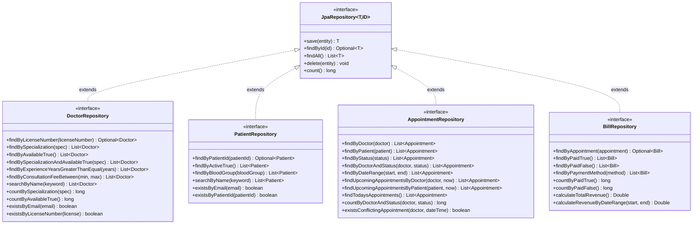

---

## 3. Spring Boot Service Layer

```mermaid
classDiagram
    class DoctorService {
        <<@Service>>
        <<@Transactional>>
        -DoctorRepository doctorRepository
        -ModelMapper modelMapper
        +registerDoctor(requestDTO) DoctorResponseDTO
        +getDoctorById(id) DoctorResponseDTO
        +getAllDoctors() List~DoctorResponseDTO~
        +getAvailableDoctors() List~DoctorResponseDTO~
        +getDoctorsBySpecialization(spec) List~DoctorResponseDTO~
        +searchDoctors(keyword) List~DoctorResponseDTO~
        +getDoctorsByMinExperience(years) List~DoctorResponseDTO~
        +getDoctorsByFeeRange(min, max) List~DoctorResponseDTO~
        +getDoctorStatistics() DoctorStatistics
        +updateDoctor(id, requestDTO) DoctorResponseDTO
        +toggleAvailability(id) DoctorResponseDTO
        +deleteDoctor(id) void
    }

    class PatientService {
        <<@Service>>
        <<@Transactional>>
        -PatientRepository patientRepository
        -ModelMapper modelMapper
        +registerPatient(requestDTO) PatientResponseDTO
        +getPatientById(id) PatientResponseDTO
        +getPatientByPatientId(patientId) PatientResponseDTO
        +getAllPatients() List~PatientResponseDTO~
        +getActivePatients() List~PatientResponseDTO~
        +searchPatients(keyword) List~PatientResponseDTO~
        +getPatientsByBloodGroup(group) List~PatientResponseDTO~
        +getPatientsByAgeRange(min, max) List~PatientResponseDTO~
        +getPatientsWithAllergies() List~PatientResponseDTO~
        +getPatientStatistics() PatientStatistics
        +updatePatient(id, requestDTO) PatientResponseDTO
        +deactivatePatient(id) PatientResponseDTO
        +activatePatient(id) PatientResponseDTO
        +clonePatient(id) PatientResponseDTO
        +deletePatient(id) void
    }

    class AppointmentService {
        <<@Service>>
        <<@Transactional>>
        -AppointmentRepository appointmentRepository
        -DoctorRepository doctorRepository
        -PatientRepository patientRepository
        -ModelMapper modelMapper
        -List~AppointmentObserver~ observers
        +bookAppointment(requestDTO) AppointmentResponseDTO
        +getAppointmentById(id) AppointmentResponseDTO
        +getAllAppointments() List~AppointmentResponseDTO~
        +getAppointmentsByDoctor(doctorId) List~AppointmentResponseDTO~
        +getAppointmentsByPatient(patientId) List~AppointmentResponseDTO~
        +getUpcomingAppointmentsByDoctor(doctorId) List~AppointmentResponseDTO~
        +getTodaysAppointments() List~AppointmentResponseDTO~
        +getAppointmentsByStatus(status) List~AppointmentResponseDTO~
        +confirmAppointment(id) AppointmentResponseDTO
        +cancelAppointment(id) AppointmentResponseDTO
        +startAppointment(id) AppointmentResponseDTO
        +completeAppointment(id, diagnosis, prescription) AppointmentResponseDTO
        +rescheduleAppointment(id, newDateTime) AppointmentResponseDTO
        +registerObserver(observer) void
        +removeObserver(observer) void
        -notifyObservers(appointment, event) void
    }

    class BillService {
        <<@Service>>
        <<@Transactional>>
        -BillRepository billRepository
        -AppointmentRepository appointmentRepository
        -BillFactory billFactory
        -ModelMapper modelMapper
        +generateBill(requestDTO) BillResponseDTO
        +generateBillWithStrategy(appointmentId, strategy) BillResponseDTO
        +getBillById(id) BillResponseDTO
        +getBillByAppointment(appointmentId) BillResponseDTO
        +getAllBills() List~BillResponseDTO~
        +getUnpaidBills() List~BillResponseDTO~
        +getPaidBills() List~BillResponseDTO~
        +getBillsByPaymentMethod(method) List~BillResponseDTO~
        +processPayment(id, method, transactionId) BillResponseDTO
        +applyDiscount(id, amount) BillResponseDTO
        +applyPercentageDiscount(id, percentage) BillResponseDTO
        +generateBillSummary(id) BillSummary
        +calculateTotalRevenue() Double
        +calculateRevenueByDateRange(start, end) Double
        +getTopRevenueGeneratingDoctors(limit) List~DoctorRevenue~
        +getBillingStatistics() BillingStatistics
    }

    DoctorService --> DoctorRepository : uses
    PatientService --> PatientRepository : uses
    AppointmentService --> AppointmentRepository : uses
    AppointmentService --> DoctorRepository : uses
    AppointmentService --> PatientRepository : uses
    BillService --> BillRepository : uses
    BillService --> AppointmentRepository : uses
    BillService --> BillFactory : uses
```

---

## 4. REST Controller Layer

```mermaid
classDiagram
    class DoctorController {
        <<@RestController>>
        <<@RequestMapping("/api/v1/doctors")>>
        -DoctorService doctorService
        +registerDoctor(requestDTO) ResponseEntity~DoctorResponseDTO~
        +getDoctorById(id) ResponseEntity~DoctorResponseDTO~
        +getAllDoctors() ResponseEntity~List~DoctorResponseDTO~~
        +getAvailableDoctors() ResponseEntity~List~DoctorResponseDTO~~
        +getDoctorsBySpecialization(spec) ResponseEntity~List~DoctorResponseDTO~~
        +searchDoctors(keyword) ResponseEntity~List~DoctorResponseDTO~~
        +getDoctorsByExperience(years) ResponseEntity~List~DoctorResponseDTO~~
        +getDoctorsByFeeRange(min, max) ResponseEntity~List~DoctorResponseDTO~~
        +getDoctorStatistics() ResponseEntity~DoctorStatistics~
        +updateDoctor(id, requestDTO) ResponseEntity~DoctorResponseDTO~
        +toggleAvailability(id) ResponseEntity~DoctorResponseDTO~
        +deleteDoctor(id) ResponseEntity~Void~
    }

    class PatientController {
        <<@RestController>>
        <<@RequestMapping("/api/v1/patients")>>
        -PatientService patientService
        +registerPatient(requestDTO) ResponseEntity~PatientResponseDTO~
        +getPatientById(id) ResponseEntity~PatientResponseDTO~
        +getPatientByPatientId(patientId) ResponseEntity~PatientResponseDTO~
        +getAllPatients() ResponseEntity~List~PatientResponseDTO~~
        +getActivePatients() ResponseEntity~List~PatientResponseDTO~~
        +searchPatients(keyword) ResponseEntity~List~PatientResponseDTO~~
        +getPatientsByBloodGroup(group) ResponseEntity~List~PatientResponseDTO~~
        +getPatientsByAgeRange(min, max) ResponseEntity~List~PatientResponseDTO~~
        +getPatientsWithAllergies() ResponseEntity~List~PatientResponseDTO~~
        +getPatientStatistics() ResponseEntity~PatientStatistics~
        +updatePatient(id, requestDTO) ResponseEntity~PatientResponseDTO~
        +deactivatePatient(id) ResponseEntity~PatientResponseDTO~
        +activatePatient(id) ResponseEntity~PatientResponseDTO~
        +clonePatient(id) ResponseEntity~PatientResponseDTO~
        +deletePatient(id) ResponseEntity~Void~
    }

    class AppointmentController {
        <<@RestController>>
        <<@RequestMapping("/api/v1/appointments")>>
        -AppointmentService appointmentService
        -EmailNotificationObserver emailObserver
        -SmsNotificationObserver smsObserver
        +init() void
        +bookAppointment(requestDTO) ResponseEntity~AppointmentResponseDTO~
        +getAppointmentById(id) ResponseEntity~AppointmentResponseDTO~
        +getAllAppointments() ResponseEntity~List~AppointmentResponseDTO~~
        +getAppointmentsByDoctor(doctorId) ResponseEntity~List~AppointmentResponseDTO~~
        +getAppointmentsByPatient(patientId) ResponseEntity~List~AppointmentResponseDTO~~
        +getTodaysAppointments() ResponseEntity~List~AppointmentResponseDTO~~
        +getAppointmentsByStatus(status) ResponseEntity~List~AppointmentResponseDTO~~
        +confirmAppointment(id) ResponseEntity~AppointmentResponseDTO~
        +cancelAppointment(id) ResponseEntity~AppointmentResponseDTO~
        +startAppointment(id) ResponseEntity~AppointmentResponseDTO~
        +completeAppointment(id, diagnosis, prescription) ResponseEntity~AppointmentResponseDTO~
        +rescheduleAppointment(id, newDateTime) ResponseEntity~AppointmentResponseDTO~
        +deleteAppointment(id) ResponseEntity~Void~
    }

    class BillController {
        <<@RestController>>
        <<@RequestMapping("/api/v1/bills")>>
        -BillService billService
        -StandardBillingStrategy standardStrategy
        -PremiumBillingStrategy premiumStrategy
        -DiscountedBillingStrategy discountedStrategy
        +generateBill(requestDTO) ResponseEntity~BillResponseDTO~
        +generateStandardBill(appointmentId) ResponseEntity~BillResponseDTO~
        +generatePremiumBill(appointmentId) ResponseEntity~BillResponseDTO~
        +generateDiscountedBill(appointmentId) ResponseEntity~BillResponseDTO~
        +getBillById(id) ResponseEntity~BillResponseDTO~
        +getBillByAppointment(appointmentId) ResponseEntity~BillResponseDTO~
        +getAllBills() ResponseEntity~List~BillResponseDTO~~
        +getUnpaidBills() ResponseEntity~List~BillResponseDTO~~
        +getPaidBills() ResponseEntity~List~BillResponseDTO~~
        +getBillingStatistics() ResponseEntity~BillingStatistics~
        +getTotalRevenue() ResponseEntity~Double~
        +getRevenueByDateRange(start, end) ResponseEntity~Double~
        +getTopDoctors(limit) ResponseEntity~List~DoctorRevenue~~
        +getBillSummary(id) ResponseEntity~BillSummary~
        +processPayment(id, method, transactionId) ResponseEntity~BillResponseDTO~
        +applyDiscount(id, amount) ResponseEntity~BillResponseDTO~
        +applyPercentageDiscount(id, percentage) ResponseEntity~BillResponseDTO~
        +deleteBill(id) ResponseEntity~Void~
    }

    DoctorController --> DoctorService : uses
    PatientController --> PatientService : uses
    AppointmentController --> AppointmentService : uses
    BillController --> BillService : uses
```

---

## 5. Design Patterns Implementation

### 5.1 Singleton Pattern

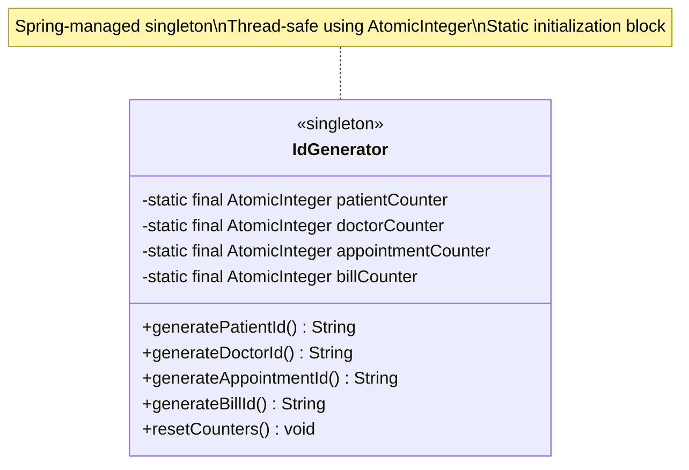

### 5.2 Factory Pattern

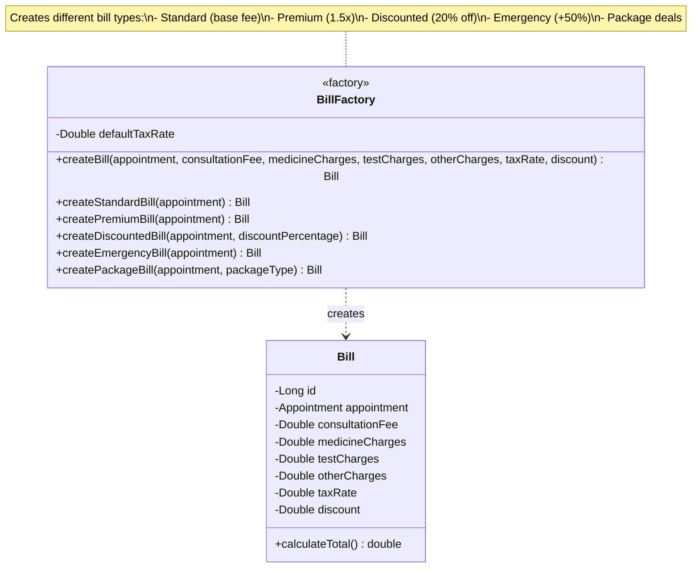

### 5.3 Strategy Pattern

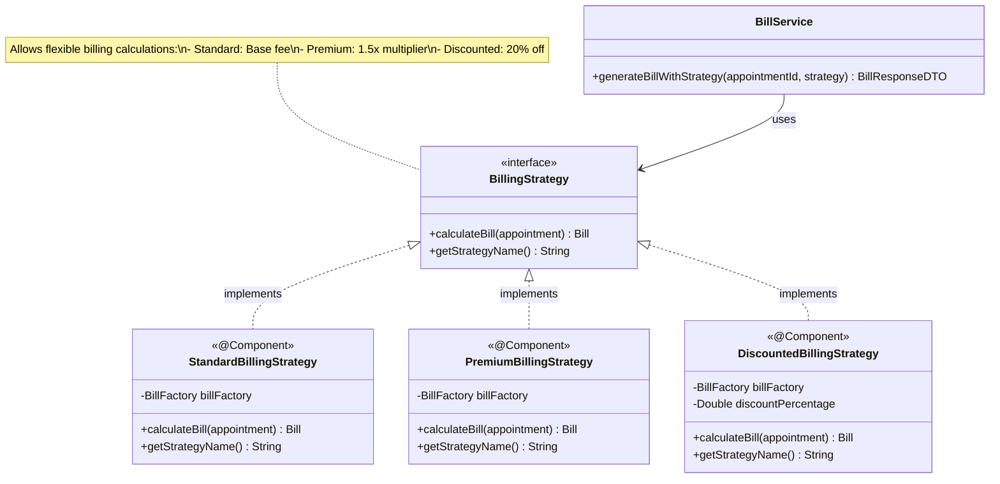

### 5.4 Observer Pattern

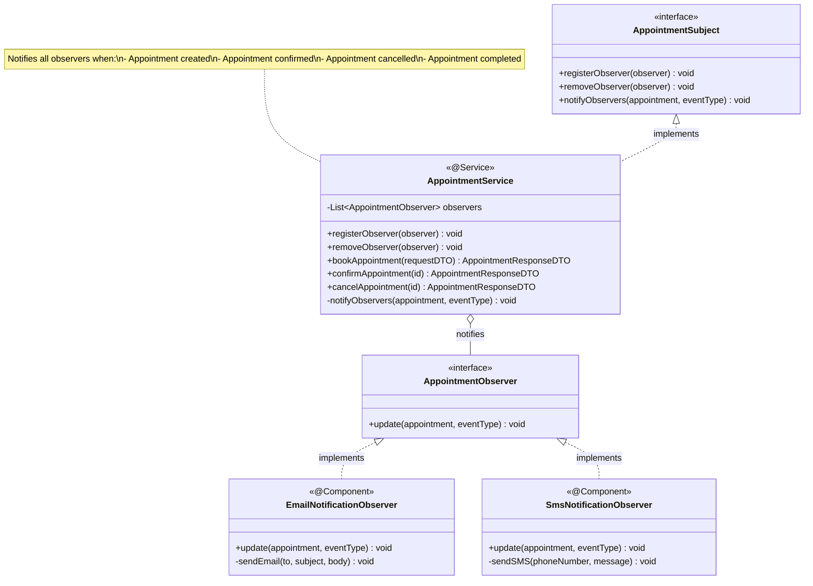

---

## 6. DTO Layer

```mermaid
classDiagram
    class DoctorRequestDTO {
        <<@Data>>
        -String firstName
        -String lastName
        -String email
        -String phoneNumber
        -Gender gender
        -LocalDate dateOfBirth
        -String address
        -String licenseNumber
        -Specialization specialization
        -Double consultationFee
        -Integer experienceYears
        -String qualifications
        -Boolean available
    }

    class DoctorResponseDTO {
        <<@Data>>
        -Long id
        -String firstName
        -String lastName
        -String fullName
        -String email
        -String phoneNumber
        -Gender gender
        -Integer age
        -String licenseNumber
        -Specialization specialization
        -String specializationDisplayName
        -Double consultationFee
        -Integer experienceYears
        -String qualifications
        -Boolean available
        -Integer activeAppointmentsCount
    }

    class PatientRequestDTO {
        <<@Data>>
        -String firstName
        -String lastName
        -String email
        -String phoneNumber
        -Gender gender
        -LocalDate dateOfBirth
        -String address
        -String bloodGroup
        -String medicalHistory
        -String allergies
        -String emergencyContact
    }

    class PatientResponseDTO {
        <<@Data>>
        -Long id
        -String patientId
        -String firstName
        -String lastName
        -String fullName
        -String email
        -String phoneNumber
        -Gender gender
        -Integer age
        -String bloodGroup
        -String medicalHistory
        -String allergies
        -String emergencyContact
        -Boolean active
    }

    class AppointmentRequestDTO {
        <<@Data>>
        -Long doctorId
        -Long patientId
        -LocalDateTime appointmentDateTime
        -Integer durationMinutes
        -String symptoms
        -String notes
    }

    class AppointmentResponseDTO {
        <<@Data>>
        -Long id
        -Long doctorId
        -String doctorName
        -Long patientId
        -String patientName
        -LocalDateTime appointmentDateTime
        -Integer durationMinutes
        -String symptoms
        -AppointmentStatus status
        -String diagnosis
        -String prescription
        -String notes
        -Boolean upcoming
        -Boolean past
    }

    class BillRequestDTO {
        <<@Data>>
        -Long appointmentId
        -Double consultationFee
        -Double medicineCharges
        -Double testCharges
        -Double otherCharges
        -Double taxRate
        -Double discount
    }

    class BillResponseDTO {
        <<@Data>>
        -Long id
        -Long appointmentId
        -String patientName
        -String doctorName
        -Double consultationFee
        -Double medicineCharges
        -Double testCharges
        -Double otherCharges
        -Double subtotal
        -Double taxRate
        -Double taxAmount
        -Double discount
        -Double total
        -Boolean paid
        -String paymentMethod
        -String transactionId
        -LocalDateTime createdAt
        -LocalDateTime paidAt
    }
```

---

## 7. Utility Classes

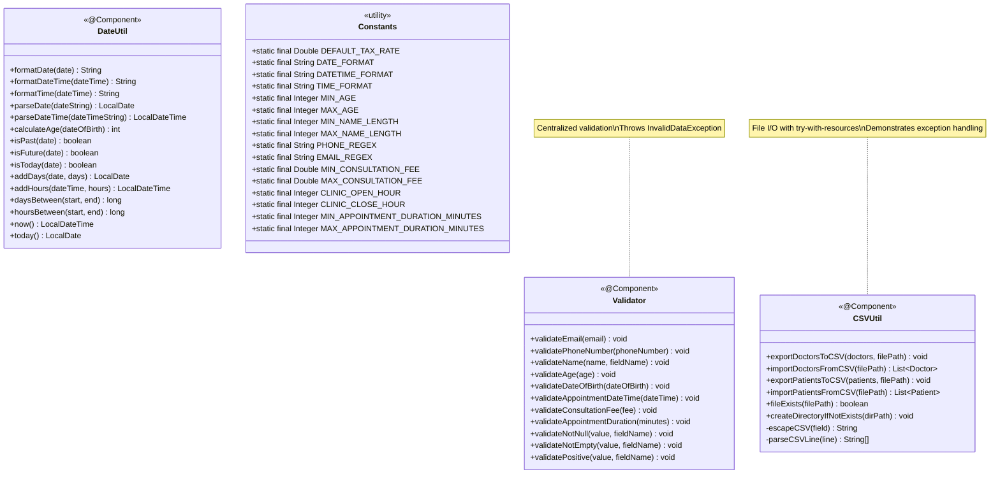

---

## 8. Exception Hierarchy

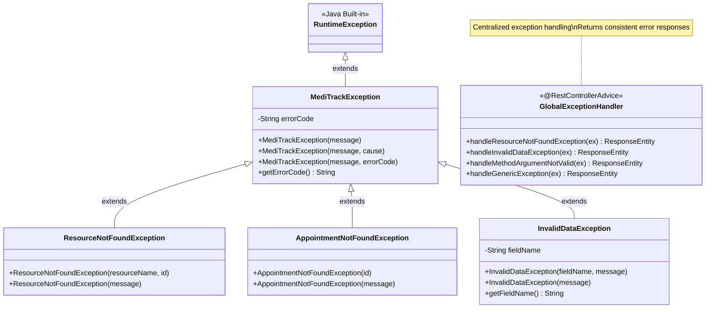

---

## 9. Interfaces

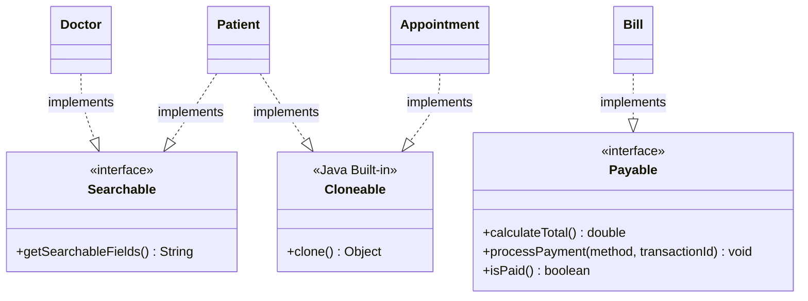

---

## 10. Spring Boot Configuration

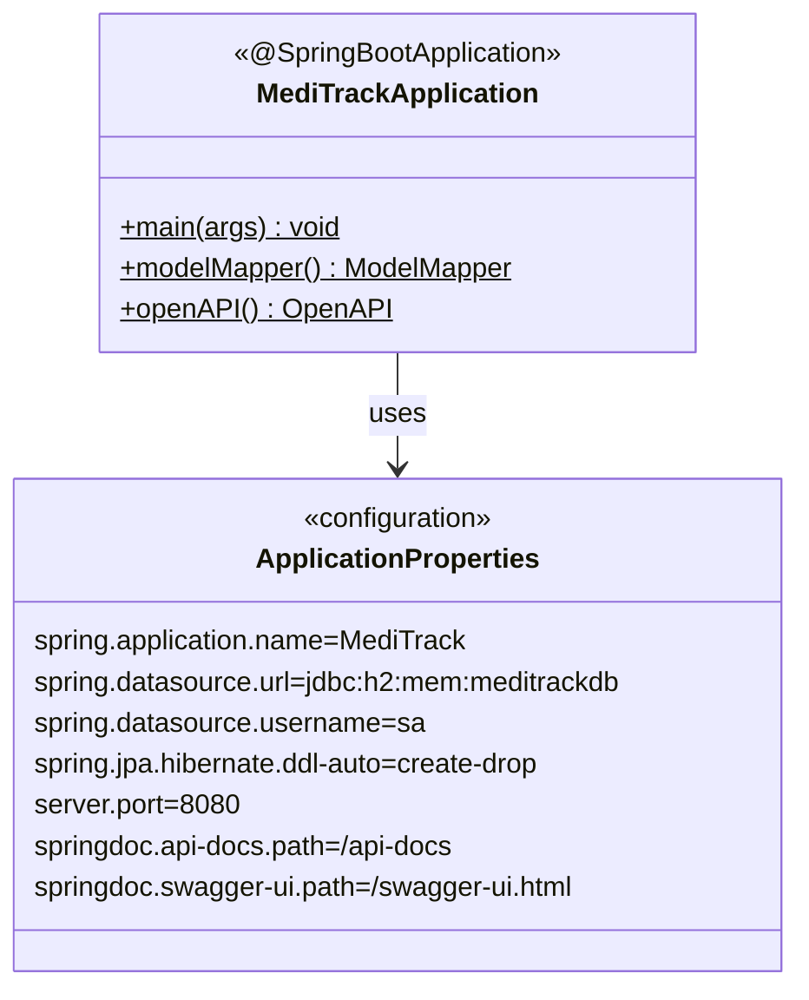

---

## 11. Complete Package Structure

```
com.airtribe.meditrack
├── MediTrackApplication.java
├── constants/
│   └── Constants.java
├── enums/
│   ├── Specialization.java
│   ├── AppointmentStatus.java
│   └── Gender.java
├── entity/
│   ├── Person.java (abstract)
│   ├── Doctor.java
│   ├── Patient.java
│   ├── Appointment.java
│   ├── Bill.java
│   └── BillSummary.java (immutable)
├── repository/
│   ├── DoctorRepository.java
│   ├── PatientRepository.java
│   ├── AppointmentRepository.java
│   └── BillRepository.java
├── service/
│   ├── DoctorService.java
│   ├── PatientService.java
│   ├── AppointmentService.java
│   └── BillService.java
├── controller/
│   ├── DoctorController.java
│   ├── PatientController.java
│   ├── AppointmentController.java
│   └── BillController.java
├── dto/
│   ├── DoctorRequestDTO.java
│   ├── DoctorResponseDTO.java
│   ├── PatientRequestDTO.java
│   ├── PatientResponseDTO.java
│   ├── AppointmentRequestDTO.java
│   ├── AppointmentResponseDTO.java
│   ├── BillRequestDTO.java
│   └── BillResponseDTO.java
├── exception/
│   ├── MediTrackException.java
│   ├── ResourceNotFoundException.java
│   ├── AppointmentNotFoundException.java
│   ├── InvalidDataException.java
│   └── GlobalExceptionHandler.java
├── interfaces/
│   ├── Searchable.java
│   └── Payable.java
└── util/
    ├── IdGenerator.java (Singleton)
    ├── Validator.java
    ├── DateUtil.java
    ├── CSVUtil.java
    ├── factory/
    │   └── BillFactory.java
    ├── strategy/
    │   ├── BillingStrategy.java
    │   ├── StandardBillingStrategy.java
    │   ├── PremiumBillingStrategy.java
    │   └── DiscountedBillingStrategy.java
    └── observer/
        ├── AppointmentObserver.java
        ├── AppointmentSubject.java
        ├── EmailNotificationObserver.java
        └── SmsNotificationObserver.java
```

---

## 12. Key Relationships Summary

### Inheritance
- `Patient` extends `Person`
- `Doctor` extends `Person`
- `MediTrackException` extends `RuntimeException`
- `ResourceNotFoundException` extends `MediTrackException`
- `AppointmentNotFoundException` extends `MediTrackException`
- `InvalidDataException` extends `MediTrackException`

### Composition (Strong "has-a")
- `Appointment` has `Patient`
- `Appointment` has `Doctor`
- `Bill` has `Appointment`

### Aggregation (Weak "has-a")
- `Doctor` has `Specialization` (enum)
- `Appointment` has `AppointmentStatus` (enum)
- `Person` has `Gender` (enum)

### Implementation
- `Doctor` implements `Searchable`
- `Patient` implements `Searchable`, `Cloneable`
- `Appointment` implements `Cloneable`
- `Bill` implements `Payable`
- `StandardBillingStrategy` implements `BillingStrategy`
- `PremiumBillingStrategy` implements `BillingStrategy`
- `DiscountedBillingStrategy` implements `BillingStrategy`
- `EmailNotificationObserver` implements `AppointmentObserver`
- `SmsNotificationObserver` implements `AppointmentObserver`
- `AppointmentService` implements `AppointmentSubject`

### Dependency
- Controllers depend on Services
- Services depend on Repositories
- Services depend on ModelMapper
- BillService depends on BillFactory
- BillService depends on BillingStrategy
- AppointmentService depends on AppointmentObserver
- All repositories extend JpaRepository

---

## 13. Design Patterns Summary

| Pattern | Implementation | Purpose |
|---------|----------------|---------|
| **Singleton** | `IdGenerator` (@Component) | Thread-safe ID generation using AtomicInteger |
| **Factory** | `BillFactory` | Create different bill types (Standard, Premium, Discounted, Emergency, Package) |
| **Strategy** | `BillingStrategy` | Flexible billing calculations (Standard, Premium, Discounted) |
| **Observer** | `AppointmentObserver` | Notify observers (Email, SMS) on appointment events |
| **DTO** | Request/Response DTOs | Decouple API from domain model |
| **Repository** | Spring Data JPA | Abstract data access layer |
| **Dependency Injection** | Spring @Autowired | Loose coupling, testability |
| **MVC** | Controller-Service-Repository | Separation of concerns |

---

## Notes

1. **Technology Stack**:
   - Spring Boot 3.2.2
   - Java 17
   - H2 Database (in-memory)
   - Spring Data JPA
   - Lombok
   - ModelMapper
   - Swagger/OpenAPI
   - Bean Validation

2. **Key Differences from Original UML**:
   - ✅ Spring Boot REST API (not console application)
   - ✅ JPA Repositories (not DataStore)
   - ✅ Controllers for REST endpoints
   - ✅ DTOs for request/response
   - ✅ BillingStrategy (not PaymentStrategy)
   - ✅ Email/SMS observers (not generic NotificationObserver)
   - ✅ Spring annotations throughout
   - ✅ Transaction management
   - ✅ Global exception handling

3. **Mermaid Rendering**:
   - GitHub (native support)
   - VS Code (Mermaid extension)
   - mermaid.live
   - Documentation generators

---

**Generated for**: MediTrack Spring Boot v1.0.0  
**Date**: February 12, 2026  
**Total Classes**: 51  
**Design Patterns**: 4 (Singleton, Factory, Strategy, Observer)  
**REST Endpoints**: 57+  
**Status**: ✅ **MATCHES ACTUAL CODEBASE**
